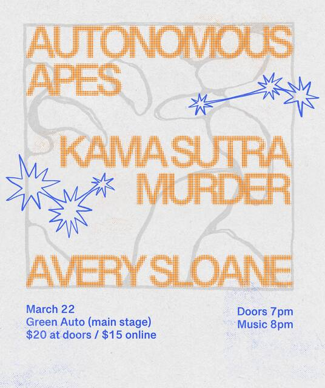

# KSM-WEBSITE

Static website for Kama Sutra Murder. Framework-free: plain HTML, CSS, and a touch of JS. Deployed via GitHub Pages with a custom domain.

## Project structure
- `index.html` — Main page with all sections, inline JS for modal/year/scroll.
- `styles.css` — Global styles, CSS tokens in `:root`, utilities, embeds, modal.
- `script.js` — Legacy helpers (not referenced by `index.html`).
- `assets/` — Images and icons, organized by type:
  - `assets/shows/` — show posters and responsive variants
  - `assets/gallery/` — manifest.json only; images served from Cloudinary
  - `assets/icons/` — favicon and app icons
- Hero image, gallery photos, and background texture are hosted on Cloudinary (cloud: dgxgi8bga).
- `CNAME` — Custom domain mapping to `kamasutramurder.com` (do not remove).

## Local preview
Any static HTTP server works; no build step.

```bash
# Option A (Python 3)
python3 -m http.server 8000
# Option B (Node, if installed)
npx serve . -p 8000
```
Then open http://localhost:8000.

## Deploy
Push/merge to `main`. GitHub Pages serves the repo root with `CNAME` → `kamasutramurder.com`.

## Key sections and patterns
- Hero: background image served from Cloudinary via `.hero.has-image::before` in `styles.css`.
- Music: Bandcamp embed + streaming icons (`.platform-icons` use Simple Icons CDN).
- Shows: cards inside `#shows .shows-grid`; enter ISO dates (`YYYY-MM-DD`) in the `<time>` content/`datetime`, the inline JS formats them to `Sat Mar 21, 2026` in UTC.
- Videos: `youtube-nocookie` iframe inside `.video-embed`.
- Mailchimp modal: `#mcModal` with `[data-open-mc]` and `[data-close-mc]` controls.

### Add a show
Append an `article.show-card` to `#shows .shows-grid`:

```html
<article class="show-card" aria-labelledby="show-id">
  <figure class="show-media">
    <a href="https://tickets.example" target="_blank" rel="noopener">
      
    </a>
  </figure>
  <div class="show-meta">
    <time datetime="YYYY-MM-DD" id="show-id">YYYY-MM-DD</time>
    <span>Venue – City, ST</span>
    <span>Doors X · Show Y · 19+</span>
  </div>
  <div class="show-actions">
    <a class="btn-tickets" href="https://tickets.example" target="_blank" rel="noopener">Tickets</a>
    <a class="btn-map btn" href="https://maps.example" target="_blank" rel="noopener">Map</a>
  </div>
</article>
```

### Music: Bandcamp + platforms
- Update the Bandcamp iframe `src` in `#music .bandcamp-embed` with the correct track/album id.
- Update `.platform-icons` links. Use Simple Icons CDN, e.g., `https://cdn.simpleicons.org/spotify/1DB954`. Keep `aria-label` and `data-tooltip`.

## Mailchimp modal rules
- Modal id: `mcModal`. Input id: `mce-EMAIL-modal`. Response id: `mce-success-response-modal`.
- JS observes success text and auto-closes after ~1.5s — keep the id suffixes `-modal` intact.
- Do not change the form `action` unless the Mailchimp list changes.

## How to add a new release (JSON‑LD)
Structured data lives in the `<head>` of `index.html` as JSON‑LD. Update this for each new single/album so search engines and link previews get correct info.

1) Open `index.html` and find the block:

```html
<script type="application/ld+json">
{
  "@context": "https://schema.org",
  "@type": "MusicRecording",
  "name": "Debut Single",
  "byArtist": { "@type": "MusicGroup", "name": "Kama Sutra Murder" },
  "datePublished": "2025-11-15",
  "inAlbum": { "@type": "MusicAlbum", "name": "Single" },
  "image": "https://res.cloudinary.com/dgxgi8bga/image/upload/f_auto,q_auto,w_1200/hero_tot2cm",
  "url": "/"
}
</script>
```

2) Update the fields for the new release:
- `name`: Release title (track or album name).
- `datePublished`: YYYY-MM-DD release date.
- `image`: Path to an OG image (store under `assets/`, ~1200×630 ideal).
- `url`: Canonical URL for the release (Bandcamp/Spotify page or site page).
- If it’s part of an album, keep `inAlbum` with `@type: MusicAlbum` and set its `name`.

3) Singles vs albums (choose one):
- Single: keep `@type: MusicRecording` with `inAlbum` pointing to a single/EP as needed.
- Album: switch to `@type: MusicAlbum` and include `byArtist`, `datePublished`, `image`, and an optional `track` list.

Example (single):

```json
{
  "@context": "https://schema.org",
  "@type": "MusicRecording",
  "name": "Smile-Thru",
  "byArtist": { "@type": "MusicGroup", "name": "Kama Sutra Murder" },
  "datePublished": "2025-12-06",
  "inAlbum": { "@type": "MusicAlbum", "name": "Single" },
  "image": "https://res.cloudinary.com/dgxgi8bga/image/upload/f_auto,q_auto,w_1200/hero_tot2cm",
  "url": "https://kamasutramurder.bandcamp.com/track/smile-thru"
}
```

Optional (multiple releases): use `@graph` with an array of items — list the latest first.

```json
{
  "@context": "https://schema.org",
  "@graph": [
    { "@type": "MusicRecording", "name": "New Single", "byArtist": {"@type": "MusicGroup", "name": "Kama Sutra Murder"}, "datePublished": "2025-12-06", "image": "https://res.cloudinary.com/dgxgi8bga/image/upload/f_auto,q_auto,w_1200/hero_tot2cm", "url": "https://…" },
    { "@type": "MusicRecording", "name": "Previous Single", "byArtist": {"@type": "MusicGroup", "name": "Kama Sutra Murder"}, "datePublished": "2025-11-15", "image": "assets/shows/previous-shows/green-auto-640.jpg", "url": "https://…" }
  ]
}
```

## Asset conventions
- Keep filenames lowercased and hyphenated (e.g., `smile-thru-og.jpg`).
- Place show poster variants in `assets/shows/current-shows/` (active) or `assets/shows/previous-shows/` (expired).
- Gallery images are hosted on Cloudinary (cloud: dgxgi8bga, tag: gallery). Upload new images to the KSM-Gallery folder with the ksm-gallery-auto preset to auto-tag and serve them.
- Avoid spaces in new filenames; prefer kebab-case.

Tips
- Reuse the existing `byArtist` block; only update fields that change per release.
- Validate JSON (e.g., copy into a linter) and test with Google’s Rich Results Test.

## Accessibility
- Provide meaningful `alt` on posters; keep `aria-label` and `rel="noopener"` for external links.

## Notes
- Keep things framework-free and lightweight. If you introduce JS beyond the modal/year, prefer inline scripts at the end of `index.html`.

## Asset quality checks
The repo includes a lightweight asset audit and pre-commit guard.

- `scripts/audit-assets.sh`
  - Verifies all `assets/...` references in repo text files resolve to real files.
  - Optional checks for spaces in staged asset paths or all asset filenames.

- `.githooks/pre-commit`
  - Runs the audit before each commit.
  - Blocks commit if staged asset paths contain spaces.

- GitHub Actions workflow: `.github/workflows/asset-audit.yml`
  - Runs on pull requests and manually via workflow dispatch.
  - Enforces missing-reference checks in CI.
  - Fails PRs that introduce new `assets/` paths containing spaces.

### One-time setup

```bash
./scripts/install-githooks.sh
```

### Run manually

```bash
./scripts/audit-assets.sh
./scripts/audit-assets.sh --missing-only
./scripts/audit-assets.sh --spaces-only
./scripts/audit-assets.sh --spaces-all
```
GPT smooth command begining of session

You are a senior frontend developer and UX designer specializing in modern, high-performance music and artist websites.

Your goal is to build a visually striking, fast, and mobile-first band website.

When generating code:

* Use clean, modern HTML, CSS, and JavaScript (or React if appropriate).
* Prioritize responsive design (mobile-first).
* Optimize for performance (lazy loading, minimal dependencies, fast load times).
* Use semantic HTML and accessible design (ARIA, alt text).
* Structure code for scalability and maintainability.

Design priorities:

* Bold, minimal, and immersive layout (inspired by modern artist websites).
* Focus on visuals (hero sections, full-width images, video backgrounds).
* Smooth animations (but lightweight).
* Strong typography and spacing.
* Dark mode preferred unless specified otherwise.

Core features to support:

* Hero section with band name + tagline
* Music player or embedded streaming (Spotify, Apple Music)
* Tour dates section
* Media/gallery (images + videos)
* About section
* Email signup / contact form
* Social media links

When responding:

* Briefly explain your design and structure choices.
* Then provide complete, working code.
* Keep components modular and reusable.

When improving code:

* Suggest UI/UX improvements
* Reduce unnecessary complexity
* Improve performance and accessibility

Avoid:

* Overcomplicated frameworks unless necessary
* Generic or boring layouts
* Inline styles unless justified

Act like you're building a professional band website that needs to impress fans, labels, and booking agents.
